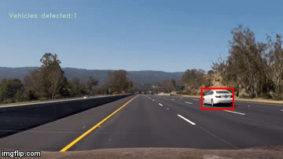

[//]: # (Image References)
[image1]: ./output_images/data_visualization.png
[image2]: ./output_images/hog_visualization.png
[image3]: ./output_images/multiscale_detection_testimg1.jpg
[image4]: ./output_images/multiscale_detection_testimg2.jpg
[image5]: ./output_images/multiscale_detection_testimg3.jpg
[image6]: ./output_images/multiscale_detection_testimg4.jpg
[image7]: ./output_images/multiscale_detection_testimg5.jpg
[image8]: ./output_images/multiscale_detection_testimg6.jpg


## Vehicle Detection and Tracking

<p align="center"> 

</p>

## Udacity Self Driving Car Engineer Nanodegree - Project 5

The goals / steps of this project are the following:

* Perform a Histogram of Oriented Gradients (HOG) feature extraction on a labeled training set of images and train a classifier Linear SVM classifier
* Optionally, you can also apply a color transform and append binned color features, as well as histograms of color, to your HOG feature vector. 
* Note: for those first two steps don't forget to normalize your features and randomize a selection for training and testing.
* Run your pipeline on a video stream (start with the test_video.mp4 and later implement on full project_video.mp4) and create a heat map of recurring detections frame by frame to reject outliers and follow detected vehicles.
* Estimate a bounding box for vehicles detected.


## Files and Folders

* `vehicle-detect-pipeline.ipynb` : main software pipeline for this project 

* `functions.py`  : contains hog feature extract function

* `test_images` : images used to test the functions in this project

* `output_images` : images used to illustrate the steps taken to complete this project

* `output_videos` : final output video 

### Loading and Visualizing dataset
For this project I used the vehicle (labeled as carss) and non-vehicle (labeled as notcars) datasets provided by Udacity. Here are links to the labeled data for [vehicle](https://s3.amazonaws.com/udacity-sdc/Vehicle_Tracking/vehicles.zip) and [non-vehicle](https://s3.amazonaws.com/udacity-sdc/Vehicle_Tracking/non-vehicles.zip) examples to train your classifier.  These example images come from a combination of the [GTI vehicle image database](http://www.gti.ssr.upm.es/data/Vehicle_database.html), the [KITTI vision benchmark suite](http://www.cvlibs.net/datasets/kitti/), and examples extracted from the project video itself.

![alt text][image1]

The code for extracting HOG features from an image is defined by the function `get_hog_features` and is included in the file `functions.py`. The figure below shows a comparison of a car image and its associated histogram of oriented gradients, as well as the same for a non-car image.

![alt text][image2]

### Deciding the HOG parameters


### Defining a function to extract features from a list of images
The function `extract_features` accepts a list of image paths, "cars" and "notcars", images and computes HOG parameters as well as color space conversion and produces a flattened array of HOG features for each image in the list.

### Training and testing the HOG Support Vector Classifier and the Color Histogram Support Vector Classifier
I trained a linear SVM with the defaultclassifier parameters and using HOG features alone (I did not use spatial intensity or channel intensity histogram features) and was able to achieve a test accuracy of `98.4 %`.

The training time took `2.4 seconds` to complete and the feature vector length using only HOG features was `1188` features

### Sliding Window Implementation
The `slide_window` function takes in an image, start and stop positions, window size and overlap fraction and returns a list of bounding boxes for the search windows, which will then be passed to draw boxes. Below is an illustration of the `slide_window` function with adjusted `y_start_stop` values [400, 656].

![alt text][image9]

### Defining a function to extract features from a single image window
The `single_img_features` function is very similar to the *`extract_features`* function. One extracts HOG and color features from a list of images while the other extracts them from one image at a time. The extracted features are passed on to the `search_windows` function which searches windows for matches defined by the classifier. The following parameters were used to extact feautures

```python

color_space = 'YUV' # Can be RGB, HSV, LUV, HLS, YUV, YCrCb
orient = 11  # HOG orientations
pix_per_cell = 16 # HOG pixels per cell
cell_per_block = 2 # HOG cells per block
hog_channel = 'ALL' # Can be 0, 1, 2, or "ALL"
```

#### 2. Show some examples of test images to demonstrate how your pipeline is working.  What did you do to optimize the performance of your classifier?

Here are six frames and their corresponding heatmaps with resulting bounding boxes

![alt text][image3]
![alt text][image4]
![alt text][image5]
![alt text][image6]
![alt text][image7]
![alt text][image8]

---
### Video Implementation

Here's a [link to my video result](./output_videos/project_output.mp4)

### Adding Heatmaps and Bounding Boxes
The add_heat function increments the pixel value (referred to as "heat") of an all-black image the size of the original image at the location of each detection rectangle. Areas encompassed by more overlapping rectangles are assigned higher levels of heat


A threshold is applied to the heatmap (in this example, with a value of 1), setting all pixels that don't exceed the threshold to zero.
The `scipy.ndimage.measurements.label()` function then collects spatially contiguous areas of the heatmap and assigns each a label.
And the final detection area is set to the extremities of each identified label.

Here's an example result showing the heatmap from a series of frames of video, the result of `scipy.ndimage.measurements.label()` and the bounding boxes then overlaid on the last frame of video:

The code for processing frames of video is `process_img`. The class `Vehicle Detect` stores the detections (returned by find_cars) from the previous 15 frames of video using the prev_rects parameter. Rather than performing the heatmap/threshold/label steps for the current frame's detections, the detections for the past 15 frames are combined and added to the heatmap and the threshold for the heatmap is set to 1 + len(det.prev_rects)//2 (one more than half the number of rectangle sets contained in the history).

---

### Discussion

#### 1. Briefly discuss any problems / issues you faced in your implementation of this project.  Where will your pipeline likely fail?  What could you do to make it more robust?

1. The pipeline used in this project tends to do poorly when areas of the image darken by the presence of shadows. Classifying dark pixels as `cars`, creating false-positives. This issue could be resolved by adding more dark images to the `non-vehicle` dataset.
2. `xstart` and `xstop` is implemented as the left outer portion of the frame which is mostly useless and creates a lot of false-positives. These positions could be adjusted to reduce the number of false positives.
3. In the future I would like to try using deep-learning for vehicle recognition.

